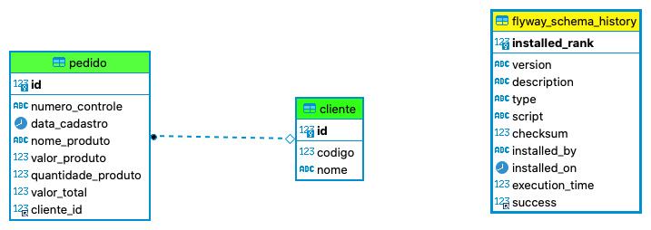

# Recepção de Pedidos

## Visão Geral

"Criar uma solução java em formato de API que atenda aos seguintes requisitos para a recepção de pedidos dos clientes:."
<br/>

✅ 

## Instructions to run the project docker-compose

```console
$ docker-compose -f docker-compose.desenvolvimento.yml --build
$ docker-compose -f docker-compose.desenvolvimento.yml up -d
```
ou 

```console
$ docker-compose -f docker-compose.desenvolvimento.yml up --build -d
```

```
Para realizar testes com o arquivo(RESTClient_TesteController.http) é necessário instalar o plugin REST Client do código do visual studio"
```

<br/>
✅ 


## Requisitos da API


A solução é em java em formato de API e atende aos seguintes requisitos para a recepção de pedidos dos clientes:


### <b>Requisitos para criar os pedidos e critérios de aceitação e manipulação do arquivo</b>
<li> Criar um serviço que receba pedidos no formato xml e json com 6 campos:<p>
número controle - número aleatório informado pelo cliente.<p>
data cadastro (opcional) <p>
nome - nome do produto<p>
valor - valor monetário unitário produto<p>
quantidade (opcional) - quantidade de produtos.<p>
codigo cliente - identificação numérica do cliente.
  <br/>

  <p>
 
**Servicço:**[http://localhost:8080/api/criar-pedidos-clientes](http://localhost:8080/api/criar-pedidos-clientes)

**Implementação:**[criarPedidosClientes(@RequestBody List<Pedido> pedidos)](./src/main/java/api/com/valadares/pedidos/controllers/RecepcaoPedidosClientesController.java#criarPedidosClientes)

 <br/>
 <br/>

<li> O arquivo pode conter 1 ou mais pedidos, limitado a 10.<p>
Não poderá aceitar um número de controle já cadastrado.<p>
Caso a data de cadastro não seja enviada o sistema deve assumir a data atual.<p>
Caso a quantidade não seja enviada considerar 1.<p>
Caso a quantidade seja maior que 5 aplicar 5% de desconto no valor total, para quantidades a partir de 10 aplicar
10% de desconto no valor total. <p>
O sistema deve calcular e gravar o valor total do pedido.
  <br/>

  <p>
  
**Implementação das regras de negócio:**[public List<Pedido> criarPedidosClientes(List<Pedido> pedidos)](./src/main/java/api/com/valadares/pedidos/services/PedidoService.java#criarPedidosClientes)

 <br/>
 <br/>

**<li>Criar um serviço onde possa consultar os pedidos enviados pelos clientes.**<p>
Critérios aceitação:<p>
O retorno deve trazer todos os dados do pedido.<p>
  
**Servicço:**[http://localhost:8080/api/pedidos-enviados-pelo-cliente?codigoCliente=2](http://localhost:8080/api/pedidos-enviados-pelo-cliente?codigoCliente=2)  

**Implementação:**[getPedidosEnviadosPeloCliente(@RequestBody Long codigoCliente)](./src/main/java/api/com/valadares/pedidos/controllers/RecepcaoPedidosClientesController.java#getPedidosEnviadosPeloCliente)

 <br/>
 <br/>


**<li> Implementacao dos filtros da consulta:** número pedido, data cadastro, todos

**Servicço:**[http://localhost:8080/api/filtro-de-consulta?getTodos=true](http://localhost:8080/api/filtro-de-consulta?getTodos=true)  

**Implementação:**[public ResponseEntity<T> getByNumeroControleOuDataCadastroOuTodos(String numeroPedido, LocalDateTime dataCadastro, Boolean getTodos)](./src/main/java/api/com/valadares/pedidos/controllers/RecepcaoPedidosClientesController.java#getByNumeroControleOuDataCadastroOuTodos)

<br/>
<br/>
<br/>

**<li>O script de criação das tabelas esta presentes em:** 

[Script criacao das tabelas](./src/main/resources/db/migration/V1__Initial_setup.sql)


**<li>O diagrama/modelo do banco de dados:** 



